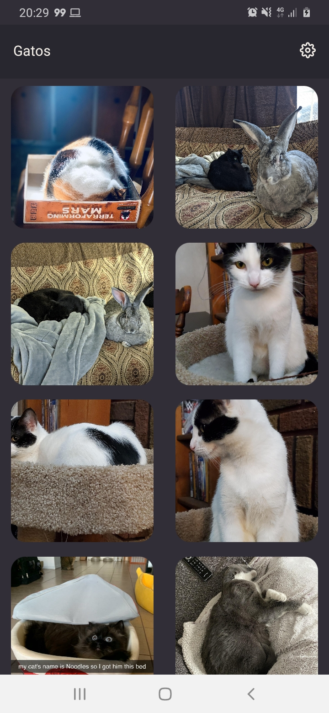
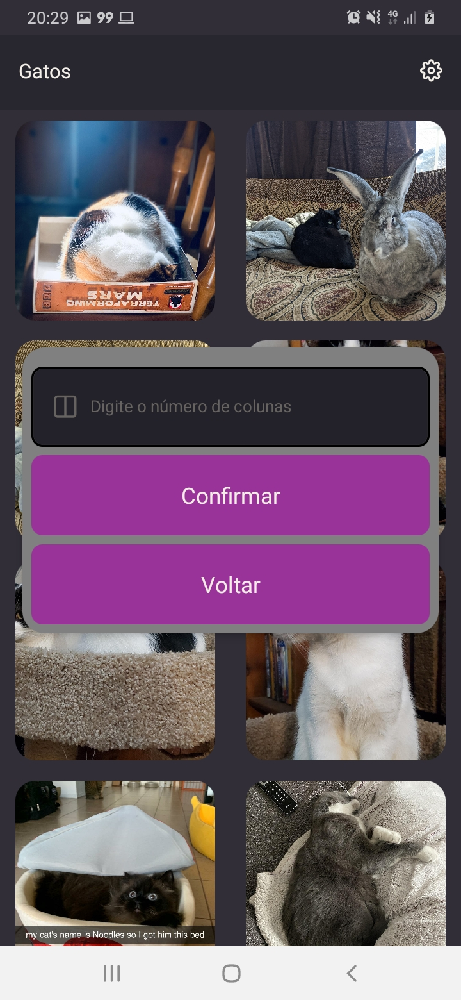
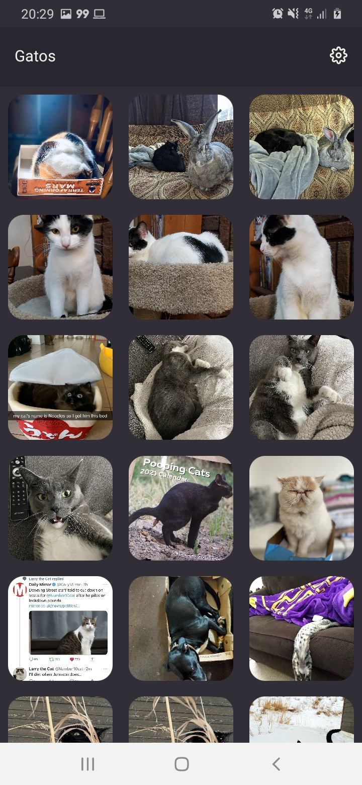
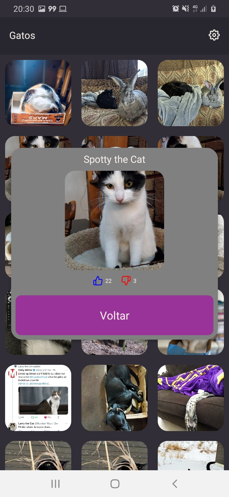
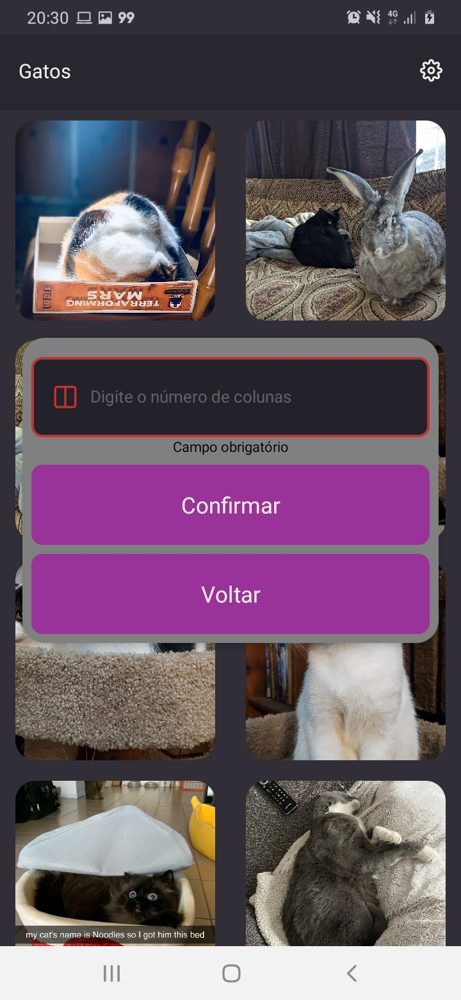
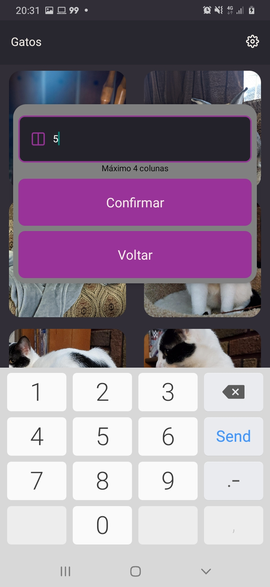

<h1 align="center">Cats Gallery</h1>
<h1 align="center">
    <a href="https://reactnative.dev/">🔗 React Native</a>
</h1>
<p align="center">Galeria de fotos de gatos, onde é possível verificar várias fotos de animais fofinhos</p>

Pre Requisitos
=================
Guia de instalação de todas as ferramentas necessárias: http://react-native.rocketseat.dev/

Como rodar
=================
```bash
# Clone este repositório
$ git clone https://github.com/sam20fonsa1098/CatsGallery.git

# Acesse a pasta do projeto no terminal/cmd
$ cd CatsGallery

# Instale as dependências
$ yarn install

# Execute a aplicação em modo de desenvolvimento
$ yarn start

# Em um outro terminal, na mesma pasta, rode o seguinte comando caso esteja usando um emulador ou device android
$ yarn android

# Em um outro terminal, na mesma pasta, rode o seguinte comando caso esteja usando um emulador ou device ios
$ yarn ios
```

Fotos da Aplicação
=================

<h1 align="center">
  
</h1>

<h1 align="center">
  
</h1>

<h1 align="center">
  
</h1>

<h1 align="center">
  
</h1>

<h1 align="center">
  
</h1>

<h1 align="center">
  
</h1>

<h1 align="center">
  
</h1>
